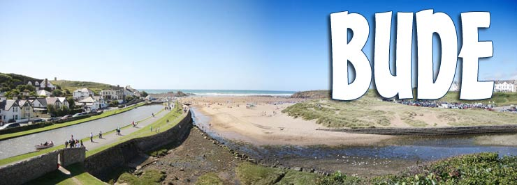
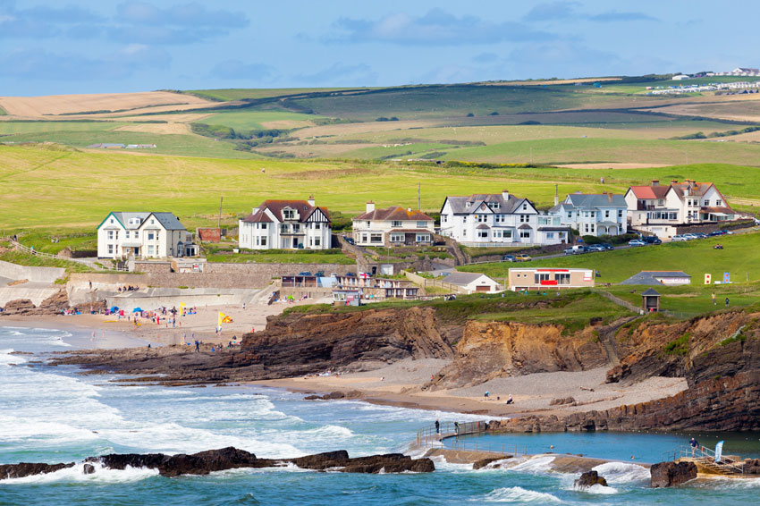
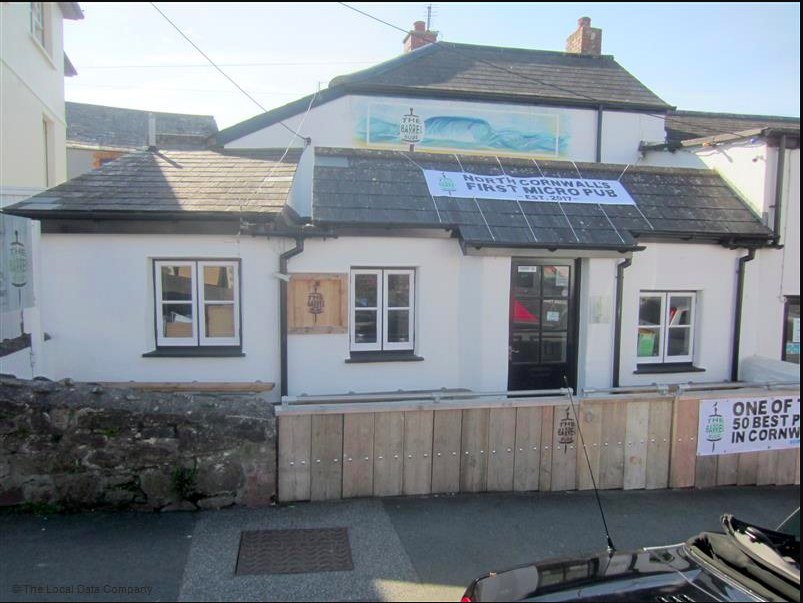
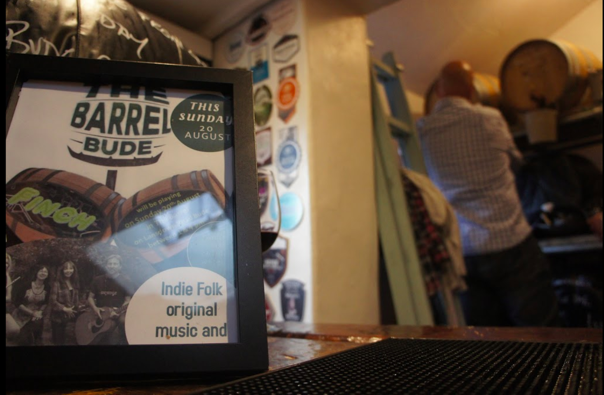

```{r setup, include=FALSE}
knitr::opts_chunk$set(echo = TRUE)
```

# Task 1: Bude 


Find the town of Bude in Western England. This is a town that is well-known as a beach resort. You're going to make two maps of Bude – a road map and a watercolor map.

A beautiful seaside resort town located in North Cornwell, Western England. Famous for its pastel painted beach huts, clean and sandy beaches, wonderful watersports activities, and others like horse-riding, cycling, rock-climbing and golfing. 


```{r}

library(ggmap)
library(tidyverse)

gc <- geocode("bude")
map <- get_map(gc)
bb <- attr(map, "bb")
bbox <- bb2bbox(bb)
```

```{r}
# Finding Bude on the map

map <- get_map(gc, zoom=16)
ggmap(map) +
  geom_point(
    aes(x = lon, y = lat),
    data = gc, color = "blue", size = 3
  )
```

# Drawing Bude road map 
```{r}
map_road <- get_map(location=gc, maptype = "roadmap",zoom= 17)
ggmap(map_road)+
  geom_point(
    aes(x = lon, y = lat),
    data = gc, color = "red", size = 3
  )
```

# Drawing watercolor map
```{r}
map_water <- get_map(location=gc, maptype = "watercolor",zoom= 17)
ggmap(map_water)+
  geom_point(
    aes(x = lon, y = lat),
    data = gc, color = "purple", size = 3
  )

```

# Task 2: Vacation Spots 
On both maps, mark the map with vacation spots you might like: surfing beaches and the cricket grounds (one of the most stunning the the country and very local). Pick two local beaches (this will require some googling).

Surfing Beaches: 


1. Summerleaze Beach:

Summerleaze beach is only 5 min walk from the center of Bude. The beautiful sandy beach is sheltered by the impressive breakwater. Especially popular among surfers and families with small children, the relaxing beach provides many fun opportunities including kayaking, and sea fishing. 


2. Crooklets Beach

Crooklets beach provides exceptionally beautiful scenaries at low tides. Home to several local surfing schools including Bude Surf Life Saving Club, Crooklets beach is very popular among beginner surfers. There are many great facilities around the beach including a play area for the kids, skate park and many pubs closeby. 





\newpage


Cricket Grounds:


Bude Cornwall Cricket Club 

Located at the clifftops overlooking the Atlantic ocean, the Bude Cornwall Cricket Club is not only a stunning place to visit, but also a fun field for playing cricket. Founded in 1870, the club joined the Cornwall Cricket League, and hosted numerous Hockey matches, Tennis and Cricket competitions from players and leagues around the world. 


```{r}
loc <- c("Summerleaze Beach","Crooklets Beach","Bude Cornwall Cricket Club")
g <- geocode(loc)
map <- get_map(g)
bb <- attr(map, "bb")
bbox <- bb2bbox(bb)

map_road <- get_map(location=g, maptype = "roadmap",zoom= 16)

ggmap(map_road)+
  geom_point(
    aes(x = lon, y = lat),
    data = g, color = "red", size = 3
  )
```

```{r}
map_water <- get_map(location=g, maptype = "watercolor",zoom= 16)

ggmap(map_water)+
  geom_point(
    aes(x = lon, y = lat),
    data = g, color = "purple", size = 3
  )

```

# Task 3: Find pub
Finally find a pub that is convenient to the cricket grounds. Mark the route from the grounds to the pub. 

Pub: The Barrel at Bude

The Barrel at Bude is the second micropub to open in Cornwall. Located at the heart of the North Cornwall seaside town, the pub only sells craft ales from local independent Cornwall brewers, including brands as Verdant, Black Flag, Harbour and Firebrand. The pub also provides popular snacks including Cornish with Cornish Pasty crisps and Cornish Charcuterie salami, making it one of the most visited pubs near the Bude resort. 





```{r}
pub <- geocode("The Barrel at Bude")
map <- get_map(pub)
bb <- attr(map, "bb")
bbox <- bb2bbox(bb)

map <- get_map(pub, zoom=16)

ggmap(map) +
  geom_point(
    aes(x = lon, y = lat),
    data = pub, color = "brown", size = 3
  )
```

Mark routes from the pub to the cricket ground.

```{r}
from <- "The Barrel at Bude"
to <- "Bude Cornwall Cricket Club"
route_df <- route(from, to, structure = "route")

map10 <- get_map("Bude", zoom = 14)
ggmap(map10) +  
  geom_path(
    aes(x = lon, y = lat), colour = "red", size = 1.5,
    data = route_df, lineend = "round"
  )

```


